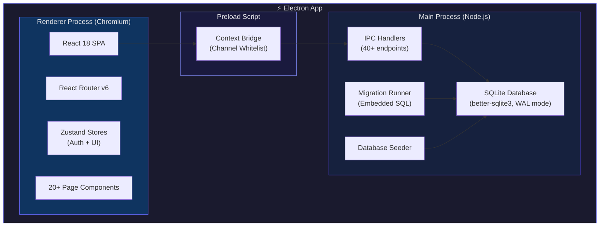
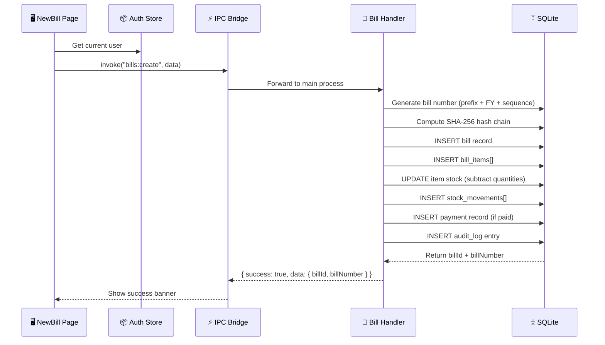
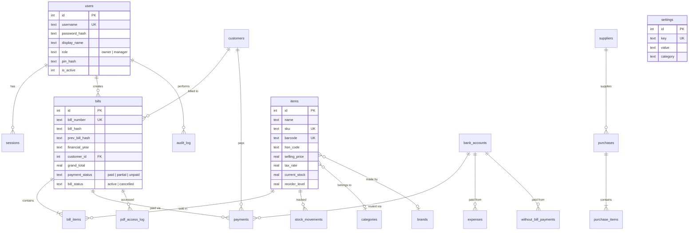
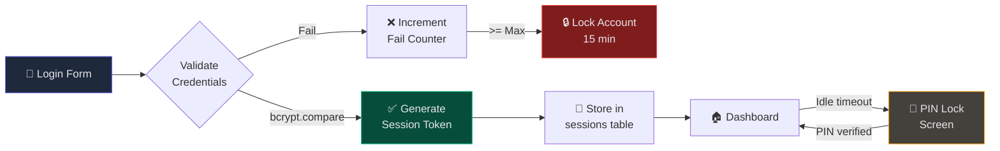
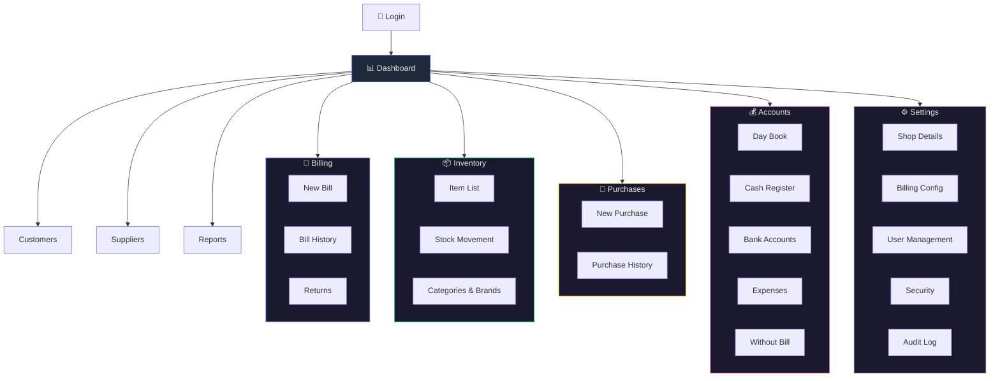
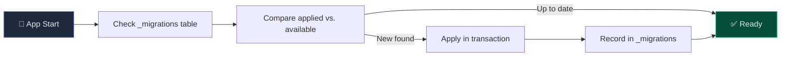

<p align="center">
  
  
  
  
  
</p>

# 📒 KhataBook — Desktop Billing & Stock Management

**KhataBook** (meaning "ledger" in Hindi) is a complete, offline-first desktop billing and stock management application purpose-built for **small Indian shopkeepers and retail businesses**. It runs entirely on your computer with no internet required — your data never leaves your machine.

> ⚡ Built with Electron + React + SQLite for speed, security, and simplicity.

---

## ✨ Key Features

| Module | Capabilities |
|---|---|
| **🧾 Billing** | GST-compliant invoicing, auto bill numbering (INV-2627-0001), CGST/SGST tax split, per-item discount, multiple payment modes (cash/UPI/card/bank/credit) |
| **📦 Inventory** | Items with SKU/barcode/HSN, categories & brands, real-time stock tracking, low-stock alerts, reorder levels, manual stock adjustment |
| **👥 Customers** | Full directory with phone, email, GSTIN, address, credit (udhaar) balance tracking |
| **🏭 Suppliers** | Supplier directory with bank details (name, A/C, IFSC), purchase tracking, balance management |
| **🛒 Purchases** | Purchase entry with auto stock update, supplier bill referencing, tax and payment tracking |
| **💰 Accounts** | Day book (daily summary), cash register (opening/closing), bank accounts, expense tracking, without-bill payments (labour/chai/petty cash) |
| **📊 Reports** | Sales summary with top items, daily breakdown, profit & loss statement, stock valuation report |
| **↩️ Returns** | Sales returns with bill lookup, item selection, automatic stock restore |
| **🔐 Security** | Role-based access (Owner/Manager), bcrypt password hashing, session tokens, PIN lock, login attempt throttling, SHA-256 bill hash chain |
| **📋 Audit** | Full audit trail of every action — bill creation, cancellation, login, user management |
| **⚙️ Settings** | Shop details, billing config (prefix, tax rate), user management (add managers), security (auto-lock, password policy) |

---

## 🏗️ Architecture

### System Overview



### Data Flow — Bill Creation



---

## 📁 Project Structure

```
khatabook/
├── src/
│   ├── main/                          # Electron main process
│   │   ├── index.ts                   # App window, lifecycle
│   │   ├── database/
│   │   │   ├── connection.ts          # SQLite connection (WAL mode)
│   │   │   ├── migrate.ts             # Embedded SQL migrations
│   │   │   └── seed.ts                # Default owner account seeder
│   │   └── ipc/
│   │       └── index.ts               # All IPC handlers (40+ endpoints)
│   │
│   ├── preload/
│   │   └── index.ts                   # Context bridge with channel whitelist
│   │
│   └── renderer/
│       └── src/
│           ├── App.tsx                # Routes & auth gating
│           ├── main.tsx               # React entry point
│           ├── styles/
│           │   └── index.css          # Design system (CSS variables, themes)
│           ├── stores/
│           │   ├── authStore.ts       # Auth state (Zustand)
│           │   └── uiStore.ts         # Theme & UI state
│           ├── lib/
│           │   └── ipc.ts             # Type-safe IPC wrapper
│           ├── components/
│           │   └── Layout/
│           │       ├── MainLayout.tsx  # Sidebar + TopBar + content
│           │       ├── Sidebar.tsx     # Collapsible navigation
│           │       └── TopBar.tsx      # Search, notifications, lock
│           └── pages/
│               ├── Login/             # Password login screen
│               ├── PinLock/           # 6-digit PIN lock screen
│               ├── Dashboard/         # Live metrics, recent bills, alerts
│               ├── Billing/
│               │   ├── NewBill.tsx     # POS-style invoice creation
│               │   ├── BillHistory.tsx # Search, filter, expand, cancel
│               │   └── Returns.tsx     # Sales returns
│               ├── Inventory/
│               │   ├── ItemList.tsx    # Item CRUD + stock adjust
│               │   ├── StockMovement.tsx # Movement history
│               │   └── Categories.tsx  # Categories & brands
│               ├── Purchases/
│               │   ├── NewPurchase.tsx  # Purchase entry
│               │   └── PurchaseHistory.tsx
│               ├── Customers/          # Customer CRUD
│               ├── Suppliers/          # Supplier CRUD
│               ├── Accounts/
│               │   ├── DayBook.tsx     # Daily summary
│               │   ├── CashRegister.tsx # Cash in/out
│               │   ├── BankAccounts.tsx # Bank account cards
│               │   ├── Expenses.tsx    # Expense tracker
│               │   └── WithoutBill.tsx # Petty cash / labour
│               ├── Reports/           # Sales, P&L, Stock reports
│               └── Settings/          # Shop, billing, users, security, audit
│
├── electron.vite.config.ts            # Vite config for Electron
├── tsconfig.json                      # TypeScript config
├── package.json
├── Start Khata.bat                    # Windows one-click launcher
└── launch_history.log                 # Auto-generated launch log
```

---

## 🗄️ Database Schema



### All 25 Tables

| Table | Purpose |
|---|---|
| `users` | Owner and manager accounts with bcrypt hashed passwords |
| `sessions` | Active login sessions with expiry and activity tracking |
| `customers` | Customer directory — name, phone, email, GSTIN, address, credit balance |
| `suppliers` | Supplier directory — contact, bank details (name, A/C, IFSC) |
| `items` | Product catalog — SKU, barcode, HSN, multi-tier pricing, tax rate, stock |
| `categories` | Item categories (hierarchical with parent_id) |
| `brands` | Item brands |
| `bills` | Sales invoices with SHA-256 hash chain for tamper detection |
| `bill_items` | Line items per invoice — qty, rate, discount, tax breakdown |
| `purchases` | Purchase orders from suppliers |
| `purchase_items` | Line items per purchase — qty, rate, batch, expiry |
| `payments` | Payment records — receipts, vouchers, refunds |
| `stock_movements` | Audit trail for every stock change (sale, purchase, adjustment, return) |
| `bank_accounts` | Business bank accounts with balance tracking |
| `expenses` | Categorized business expenses |
| `without_bill_payments` | Cash payments without formal invoices (labour, transport, chai, tips) |
| `without_bill_categories` | Preset categories for without-bill payments |
| `cash_register` | Daily cash register — opening/closing balance |
| `account_entries` | General ledger entries |
| `returns` | Sales and purchase returns |
| `return_items` | Line items per return |
| `coupons` | Discount coupons |
| `pdf_access_log` | Tracks bill PDF downloads and views |
| `audit_log` | Full action audit trail — who, what, when, before/after values |
| `settings` | App configuration — shop details, billing, security, backup |
| `backups` | Backup metadata |
| `notifications` | System notifications |

---

## 🔐 Security Architecture



**Security Features:**
- 🔒 **Password Hashing** — bcrypt with 10 salt rounds
- 🎫 **Session Tokens** — Cryptographically random 32-byte tokens with 24h expiry
- 📌 **PIN Lock** — 6-digit keypad with auto-submit
- 🚫 **Brute Force Protection** — Account locks after N failed attempts (configurable)
- 🔗 **Bill Hash Chain** — SHA-256 chain ensures bill sequence integrity and tamper detection
- 👥 **Role-Based Access** — Owner and Manager roles only
- 📋 **Audit Logging** — Every action is recorded with user ID, timestamp, and metadata
- 🔌 **Channel Whitelist** — Preload script only allows specific IPC channels

---

## 🚀 Getting Started

### Prerequisites

- **Node.js** v20+ (LTS recommended)
- **npm** v10+
- **Windows** 10/11 (primary target)

### Installation

```bash
# Clone or navigate to the project
cd c:\Users\Raghav\Desktop\raga\khata

# Install dependencies (includes native SQLite compilation)
npm install

# Start in development mode
npm run dev
```

### Quick Launch (Windows)

Double-click **`Start Khata.bat`** on your Desktop or in the project folder. It will:
1. Start the application
2. Log the launch time, close time, and user to `launch_history.log`
3. Show a branded terminal splash

### Default Login

| Field | Value |
|---|---|
| **Username** | `owner` |
| **Password** | `khata@123` |

> ⚠️ **Change the default password immediately after first login!** Go to Settings → User Management to update.

---

## ⚙️ Configuration

All settings are managed through the in-app **Settings** page (⚙️ icon in sidebar):

### Shop Details Tab
- Shop name, address, phone
- GSTIN and financial year
- Currency symbol

### Billing Tab
- Bill number prefix (e.g. `INV`)
- Purchase number prefix (e.g. `PUR`)
- Default tax rate
- Bill edit window (hours)

### User Management Tab
- Add/edit Manager accounts
- Activate/deactivate users
- Set passwords and PIN codes

### Security Tab
- Auto-lock timer (minutes)
- Max failed login attempts before lockout
- Minimum password length

### Audit Log Tab
- View complete action history
- Filter by user and action type

---

## 📐 Navigation Map



---

## 💰 Payment Routing

Khata supports **bank account routing** — the Manager must select which bank account receives each non-cash payment:

| Payment Mode | Bank Account Required? | Where |
|---|---|---|
| Cash | ❌ No | Goes to cash register |
| UPI | ✅ Yes | Manager selects bank account |
| Card | ✅ Yes | Manager selects bank account |
| Bank Transfer | ✅ Yes | Manager selects bank account |
| Credit (Udhaar) | ❌ No | Tracked as balance due |

---

## 📦 Without-Bill Payments

Track legitimate business expenses that don't have formal invoices:

| Category | Example |
|---|---|
| Labour | Daily wage workers, helpers |
| Transport | Auto/tempo/courier charges |
| Petty Cash | Small purchases under ₹500 |
| Maintenance | Shop repairs, cleaning |
| Tips | Delivery tips, service tips |
| Food & Chai | Team tea, snacks, meals |
| Miscellaneous | Anything else |

These are tracked separately from formal expenses and appear in the Day Book and P&L report.

---

## 🛠️ Tech Stack

| Layer | Technology | Purpose |
|---|---|---|
| **Desktop Shell** | Electron 32 | Native Windows desktop app |
| **Build Tool** | electron-vite + Vite 5 | Fast bundling with HMR |
| **UI Framework** | React 18 | Component-based UI |
| **Language** | TypeScript 5.6 | Type safety across the stack |
| **Routing** | React Router v6 | Client-side navigation |
| **State Management** | Zustand 4 | Lightweight global state (auth + UI) |
| **Database** | SQLite via better-sqlite3 | Embedded, zero-config, ACID, WAL mode |
| **Auth** | bcryptjs + crypto | Password hashing + session tokens |
| **Icons** | Lucide React | 1000+ modern icons |
| **CSS** | CSS Modules + Custom Properties | Scoped styling with design system |
| **Theme** | CSS Variables | Dark/light theme toggle |

---

## 🗓️ Migration System

Khata uses an embedded SQL migration system — the SQL is inlined as a template literal to avoid file-path issues with electron-vite bundling:



| Migration | Description |
|---|---|
| `001_initial.sql` | Full schema — 25 tables, indexes, seed data (default owner + settings + categories) |

---

## 📜 Data Storage

| What | Where |
|---|---|
| **Database** | `%APPDATA%\khata\khata.db` |
| **Launch Log** | `<project>\launch_history.log` |
| **Source Code** | `c:\Users\Raghav\Desktop\raga\khata\` |

The database uses SQLite **WAL (Write-Ahead Logging)** mode for better concurrent read/write performance and crash recovery.

---

## 🤝 Roles & Access

| Feature | Owner | Manager |
|---|---|---|
| Create bills | ✅ | ✅ |
| View bill history | ✅ | ✅ |
| Cancel bills | ✅ | ✅ |
| Manage items | ✅ | ✅ |
| Create purchases | ✅ | ✅ |
| Manage customers/suppliers | ✅ | ✅ |
| Select bank account for payments | ✅ | ✅ |
| Record without-bill payments | ✅ | ✅ |
| View reports | ✅ | ✅ |
| Add/remove users | ✅ | ❌ |
| Change shop settings | ✅ | ❌ |
| View audit log | ✅ | ❌ |
ompare -->|"New found"| Apply["Apply in transaction"]
    Compare -->|"Up to date"| Done["✅ Ready"]
    Apply --> Record["Record in _migrations"]
    Record --> Done

    style Start fill:#1e293b,stroke:#6366f1,color:#e4e4e7
    style Done fill:#064e3b,stroke:#10b981,color:#e4e4e7
```

| Migration | Description |
|---|---|
| `001_initial.sql` | Full schema — users, items, bills, payments, stock, settings, audit |
| `002_bill_print_vehicle_bank.sql` | Vehicle number on bills, print audit log, bank/QR settings |

---

## 🤝 Contributing

1. Fork the repository
2. Create a feature branch (`git checkout -b feature/amazing-feature`)
3. Commit your changes (`git commit -m 'Add amazing feature'`)
4. Push to the branch (`git push origin feature/amazing-feature`)
5. Open a Pull Request

---

## 📄 License

This project is licensed under the **MIT License** — see the [LICENSE](LICENSE) file for details.

---

<p align="center">
  Made with ❤️ for Indian Shopkeepers
  <br/>
  <strong>Khata</strong> — Your Digital Ledger
</p>se

MIT License. See [LICENSE](LICENSE).